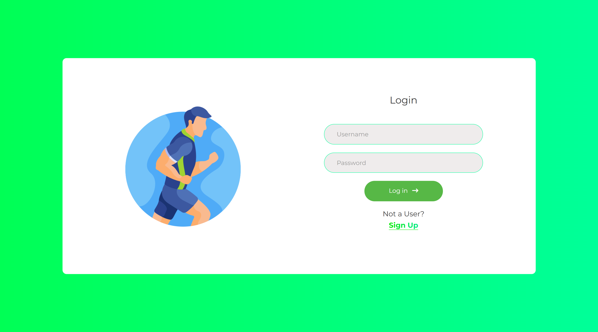
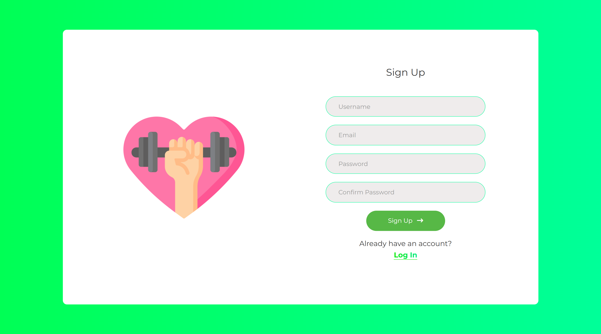
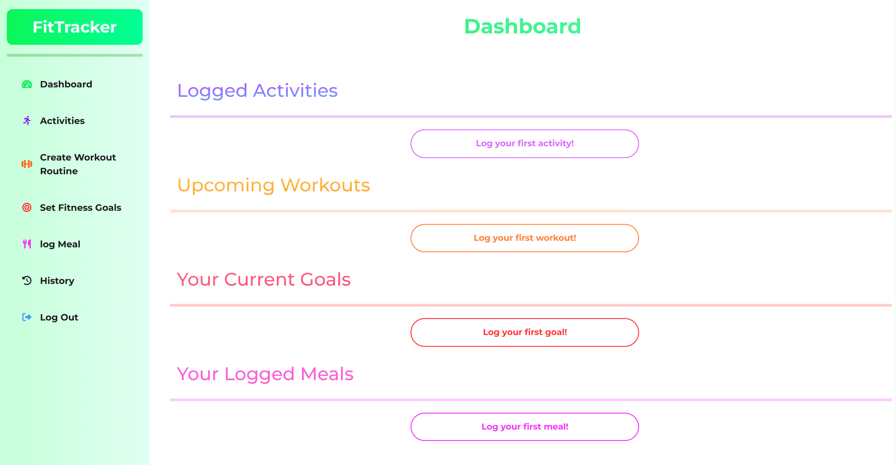
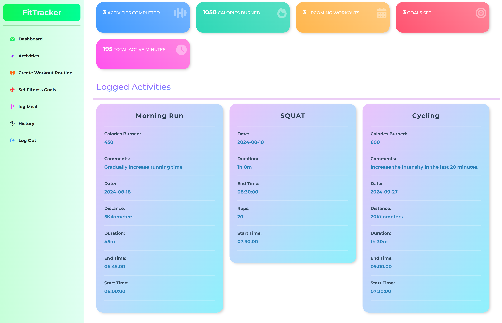
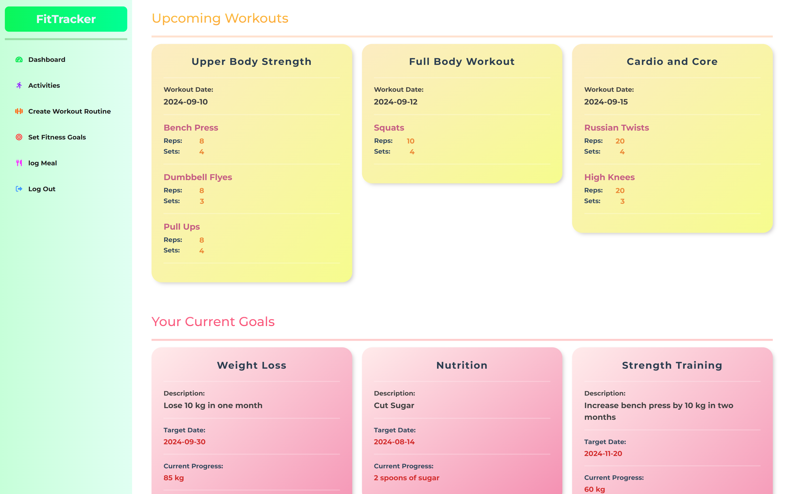
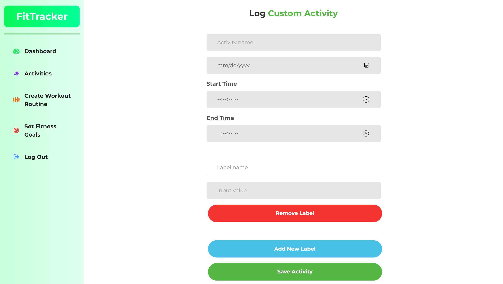
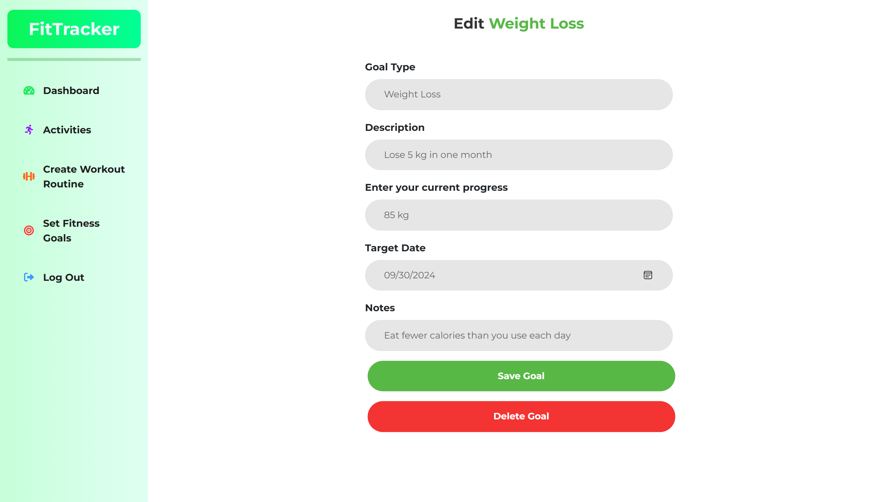

<h1 align="center">
Online Fitness Tracking App
</h1>
<div align="center">
The Online Fitness Tracking App is a web application designed to help users track their fitness activities, monitor progress, and achieve their health goals. This application is built with a Flask   backend and a Vue.js frontend, offering a responsive and user-friendly experience.
</div>

## Screenshots

Here are some screenshots of the application:

- **Authentication Interfaces**
  <div style="display: flex; gap: 10px;">
      
      
  </div>

- **Dashboard View**
  <div style="display: flex; gap: 10px;">
      
      
      
  </div>

- **Activities Page**
  

- **Activity Logging Forms**
  <div style="display: flex; gap: 10px;">
      
      
      
  </div>

- **Log Workout Interface**
  <div style="display: flex; gap: 10px;">
      
      
  </div>


- **Set Goal Interface**
  <div style="display: flex; gap: 10px;">
      
      
  </div>

## Features

- **User Authentication**: Secure login and registration to manage user-specific data with JWT-based authentication.
- **Fitness Tracking**: Log various types of activities (e.g., running, weightlifting), track workout details, and monitor progress.
- **Custom Activities**: Create and manage custom activities with dynamic labels and values, including start time, end time, and automatic duration calculation.
- **Goal Management**: Set and track fitness goals with progress updates and target dates.
- **Active Minutes Tracking**: Track and display the total number of active minutes or time spent on activities to motivate users.
- **Dashboard Overview**: View summarized fitness data including:
  - Total workouts completed
  - Calories burned
  - Upcoming workouts
  - Goals set
  - Duration of activities displayed in a human-readable format
- **Responsive Design**: Optimized for various devices and screen sizes with a user-friendly interface.
- **Detailed Analytics**: View detailed logs of activities and workouts with metrics such as distance, calories burned, and exercise details.
- **Dynamic Data Handling**: Migrated from SQLite3 to MongoDB for scalable data management and improved flexibility.
- **CRUD Operations**: Create, read, update, and delete activities, workouts, and goals through RESTful API endpoints.
- **Enhanced UI/UX**: Improved card designs, animations, and form interactions for a polished user experience.

## Technologies Used

- **Backend**: Flask, Flask-PyMongo, Flask-Migrate
- **Frontend**: Vue.js, Bootstrap
- **Database**: MongoDB
- **APIs**: Flask API endpoints for frontend-backend communication

## Installation

### MongoDB Setup

1. **Install MongoDB Server**:
   - Follow the [MongoDB installation guide](https://docs.mongodb.com/manual/installation/) to install MongoDB on your system.
   - Ensure MongoDB is running on the default port (`27017`).

### Backend Setup

1. **Navigate to the Backend Directory**:
    ```sh
    cd Backend
    ```

2. **Create and Activate a Virtual Environment**:
    ```sh
    python -m venv venv
    venv\Scripts\activate  # For Command Prompt
    # .\venv\Scripts\Activate  # For PowerShell
    ```

3. **Install Required Python Packages**:
    ```sh
    pip install -r requirements.txt
    ```

4. **Run the Flask Server**:
    ```sh
    flask run
    ```

   The Flask server will start and be accessible at `http://localhost:5000`.

### Frontend Setup

1. **Navigate to the Frontend Directory**:
    ```sh
    cd Frontend/Vue
    ```

2. **Install Node.js and npm**:
   - Download and install from [Node.js](https://nodejs.org/).

3. **Install Project Dependencies**:
    ```sh
    npm install
    ```

4. **Run the Vue.js Development Server**:
    ```sh
    npm run dev
    ```
    **By default, the application runs on localhost. If you need to run the application on a local IP address for network testing or other purposes, follow these instructions:**
    - On Unix-based systems (Linux, macOS):
    ```sh
    VITE_NETWORK=true npm run dev
    ```
    - On Windows Command Prompt:
    ```
    set VITE_NETWORK=true && npm run dev
    ```
    - On Windows PowerShell:
    ```
    $env:VITE_NETWORK="true"; npm run dev
    ```


## Documentation

- [TODO.md](TODO.md): Tasks and features to be implemented.
- [SPECIFICATIONS.md](SPECIFICATIONS.md): Detailed project specifications.
- [CHANGELOG.md](CHANGELOG.md): Record of changes and updates.

## Contributing

Contributions are welcome! Please fork the repository, make your changes, and submit a pull request.

## License

This project is licensed under the MIT License - see the [LICENSE](LICENSE) file for details.

## Contact

For questions or feedback, please reach out to [obensassi.03@gmail.com].
